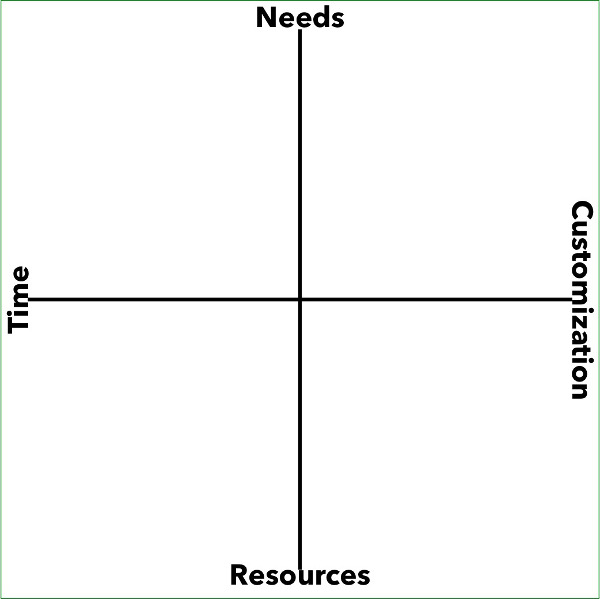
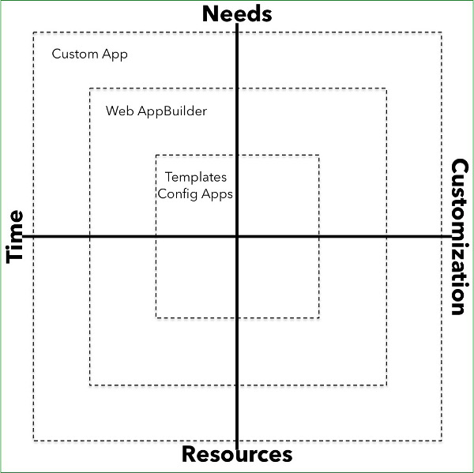
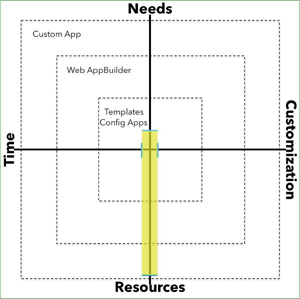
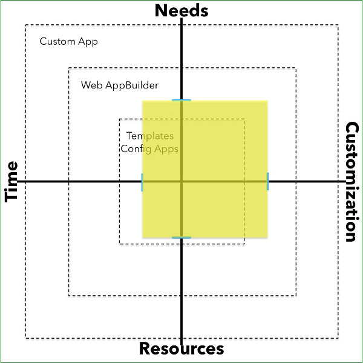
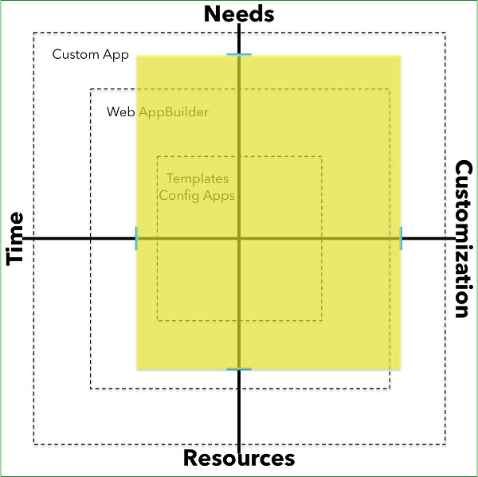
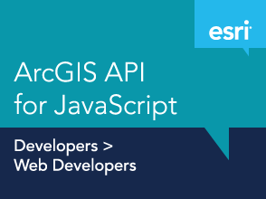

<!-- .slide: data-background="./images/title.png" -->

<!-- Presenter: Matt -->
# ArcGIS API 4.0 for JavaScript: Patterns and Best Practices

## Short URL: bit.ly/4xpatterns

---

<!-- .slide: data-background="./images/section.png" -->

### Matt Driscoll – [@driskull](https://twitter.com/driskull)
### René Rubalcava – [@odoenet](https://twitter.com/odoenet)

---

# Agenda

- 4x: What do I get?
- 4x  What are my options?
- Working with Widgets
- Getting responsive
- Using Existing Apps + Tools
- Gotchas
- Resources

---

<!-- Presenter: Rene -->
<!-- .slide: data-background="./images/section.png" -->
# What do I get with the 4x JSAPI?

- Simplified and consistent API
- Write apps in ES6 or TypeScript
- Modern browser support (IE11+)

---

<!-- .slide: data-background="./images/section.png" -->
# What are my options?

- Needs?
- Resources?
- Time?
- Customizations?

---

## What do you need?

- Charts and operational monitoring
  - Dashboard, Insights (data exploration)
- Mobile and offline
  - Native app

---

## What can you get with the JavaScript API?

- Suite of templates and configurable apps
- Out-of-the-box widgets
- Integration with various frameworks

---



---



---



---



---



---

<!-- Presenter: Matt -->
<!-- .slide: data-background="./images/section.png" -->
# Working with Widgets

---

<!-- .slide: data-background="./images/section.png" -->
# Getting Responsive with Views

---

<!-- .slide: data-background="./images/section.png" -->
# Apps

---

# Apps: Configurable AGOL

---

# Apps: Boilerplate

http://doc.arcgis.com/en/arcgis-online/create-maps/create-app-templates.htm

---

# Apps: Calcite Maps

---

<!-- Presenter: Rene -->
# Apps: Web AppBuilder

- Two Options
  - Online
  - Developer Edition

---

## Web AppBuilder - Online

- Easy to set up
- Hosted on ArcGIS.com
- Share settings
- Custom widgets in Portal
  - [blog post](https://blogs.esri.com/esri/arcgis/2017/06/30/web-appbuilder-for-arcgis-now-supports-custom-widgets-in-arcgis-enterprise-10-5-1/)

---

## Web AppBuilder - Developer Edition

- Deploy on your own site
- Use custom widgets
- [Download the SDK](https://developers.arcgis.com/web-appbuilder/)

---

## Web AppBuilder - Developer Edition

- Custom Widgets
  - [Solutions Widgets](https://github.com/Esri/solutions-webappbuilder-widgets)
  - [Widget Generator](https://github.com/Esri/generator-esri-appbuilder-js)

---

# Apps: Scaffolding app

---

## Architect your app

- TypeScript (widgets)
- Modular
- Tests
- Performance (don't over-optimize)

---

### TypeScript

- [Typings](https://github.com/Esri/jsapi-resources/tree/master/4.x/typescript) `npm install --save @types/arcgis-js-api`
- [Widget Development Guide](https://developers.arcgis.com/javascript/latest/guide/custom-widget/index.html)
- [Implementing Accessor](https://developers.arcgis.com/javascript/latest/guide/implementing-accessor/index.html)

---

### Structure your app

- Keep it modular

```json
src/
  app/
    interfaces/ <-- TypeScript Interfaces used in app
    sources/    <-- external APIs
    stores/     <-- manage application state
    styles/     <-- css files
    widgets/    <-- custom widget code
    main.ts     <-- entry point for application
  tests/        <-- unit and functional tests
```

---

### Take it further

```json
dist/                 <-- compiled and runnable application
public/               <-- non-code resources
  assets/             <-- images, fonts, icons
  favicon.ico         <-- page icon
  index.html          <-- HTML for application
  manifest.appcache   <-- application cache (fallback)
  manifest.json       <-- installable app
  oauth-callback.html <-- authentication
  service-worker.js   <-- any service worker caching you want to do
src/                  <-- application code
typings/
  extensions.d.ts     <-- any custom typings you need
package.json          <-- package file
postcss.config.js     <-- Optional PostCSS configurations
tsconfig.json         <-- TypeScript compilation configuration
tslint.json           <-- Linting for your TypeScript code
```

---

### TypeScript Best Practices
- Use `interface` over `type`
- For JSAPI modules, `import WebMap = require("esri/WebMap")`
  - We don't use default exports (need to support vanilla JS users)
  - Or JS users would need to do `var webmap = new WebMap.default()`
- Use provided decorators (Accessor and Widget)

---

### Progressive Web Apps
- _Tough with a mapping library_
- Avoid starting with a white page (application shell)
- Cache all images/css/js (appcache or service worker)
- Offline is sketchy, tricky and all around tough for mapping
- [Learn more](https://developers.google.com/web/fundamentals/getting-started/codelabs/your-first-pwapp/)

---

### Sample `manifest.appcache`

```
CACHE MANIFEST
# v0.1
index.html
oauth-callback.html
app/main.js
assets/icons/icon-256x256.png

http://js.arcgis.com/4.4/dojo/nls/dojo_en-us.js
http://js.arcgis.com/4.4/esri/views/MapView.js
http://js.arcgis.com/4.4/esri/WebMap.js

app/styles/main.css
https://s3-us-west-1.amazonaws.com/patterns.esri.com/files/calcite-web/1.0.0-rc.3/css/calcite-web.min.css

https://s3-us-west-1.amazonaws.com/patterns.esri.com/files/calcite-web/1.0.0-rc.3/fonts/calcite-ui.woff",
https://js.arcgis.com/4.4/esri/themes/base/icons/fonts/CalciteWebCoreIcons.ttf?erniwi
https://js.arcgis.com/4.4/esri/themes/base/fonts/avenir-next/Avenir_Next_W00_400.woff2
https://js.arcgis.com/4.4/esri/themes/base/fonts/avenir-next/Avenir_Next_W00_600.woff2

NETWORK:
*
```

---

### Sample Service Worker

```js
var filesToCache = [
  "./",
  "./index.html",
  "./oauth-callback.html",
  "./app/main.js",
  "http://js.arcgis.com/4.4/dojo/nls/dojo_en-us.js",
  "http://js.arcgis.com/4.4/esri/views/MapView.js",
  "http://js.arcgis.com/4.4/esri/WebMap.js",
  "./app/styles/main.css",
  "./assets/icons/icon-256x256.png",
  "https://s3-us-west-1.amazonaws.com/patterns.esri.com/files/calcite-web/1.0.0-rc.3/fonts/calcite-ui.woff",
  "https://js.arcgis.com/4.4/esri/themes/base/icons/fonts/CalciteWebCoreIcons.ttf?erniwi",
  "https://js.arcgis.com/4.4/esri/themes/base/fonts/avenir-next/Avenir_Next_W00_400.woff2",
  "https://js.arcgis.com/4.4/esri/themes/base/fonts/avenir-next/Avenir_Next_W00_600.woff2"
];
self.addEventListener("install", function(e) {
  e.waitUntil(
    caches.open(cacheName).then(function(cache) {
      return cache.addAll(filesToCache);
    })
  );
});
```

---

### Take advantage of some modern tooling
- [PostCSS](http://postcss.org/) - plugin based CSS processing
- [Prettier](https://github.com/prettier/prettier) - automatically beautify code
- Use Grunt, Gulp, or even just npm scripts

---

### Review an app

<iframe height='600' scrolling='no' title='ArcGIS JS API - Demo Appp' src='https://esridemo-5fda1.firebaseapp.com/' frameborder='no' allowtransparency='true' allowfullscreen='true' style='width: 337px;'>
</iframe>

---

<!-- .slide: data-background="./images/section.png" -->
# Gotchas

---

<!-- Presenter: Rene + Matt -->
<!-- .slide: data-background="./images/section.png" -->
# Additional Resources

<!-- - Geonet/support/rene/github/sass (Rene) -->
- [Documentation](https://developers.arcgis.com/javascript/latest)
- [4x What's new](https://developers.arcgis.com/javascript/latest/guide/whats-new/index.html)
- [4x FAQ](https://developers.arcgis.com/javascript/latest/guide/faq/index.html)

---

# JSAPI Resources
- TypeScript definition files
- Bower
- JSHint

[esriurl.com/resources](http://esriurl.com/resources)

---

# Geonet
[](https://geonet.esri.com/community/developers/web-developers/arcgis-api-for-javascript/tags#/?recursive=false&tags=4.0)


---

# Blogs
- [ArcGIS Blog](https://blogs.esri.com/esri/arcgis/tag/javascript/)
- [odoe.net](http://odoe.net/blog/)


---

# Get The Code

## [bit.ly/4xpatterns](http://bit.ly/4xpatterns)

---

# Related Sessions

- [ArcGIS API for JavaScript: What’s New](https://userconference2017.schedule.esri.com/schedule/1342175613)
- [Getting Started with ArcGIS API for JavaScript](https://userconference2017.schedule.esri.com/schedule/1303988006)
- [Building 3D GIS Applications with JavaScript](https://userconference2017.schedule.esri.com/schedule/216191407)
- [Optimizing Your JavaScript App for Performance](https://userconference2017.schedule.esri.com/schedule/187809795)
- [ArcGIS API for JavaScript: Customizing Widgets](https://userconference2017.schedule.esri.com/schedule/245657592)
- [Strategies for Building Mobile Apps Using ArcGIS API for JavaScript](https://userconference2017.schedule.esri.com/schedule/400241268)

---

<!-- .slide: data-background="./images/survey-background.png" -->

---

# Questions?


---

# Thank you!

---

<!-- .slide: data-background="./images/end.png" -->


